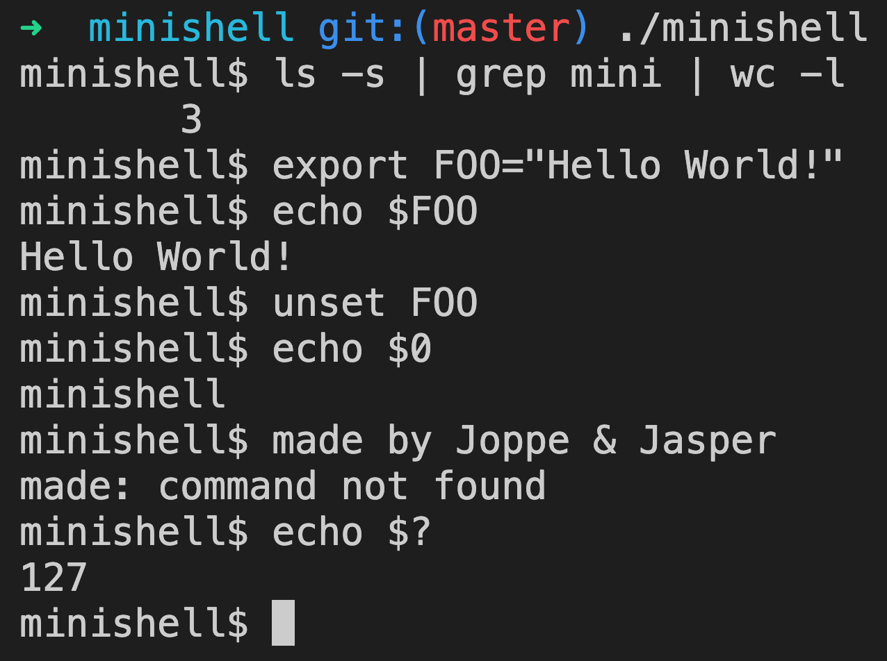

## MiniShell
A simplified implementation of a bash shell written in C form the ground up.

### Featuring
* Containing 7 builtins:
	* cd, echo, env, exit, export, pwd, unset
* Redirects, heredoc and pipes
	* \>\>, <<, >, <, |  

